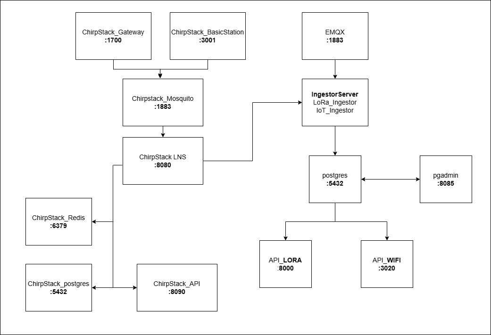

## Arquitectura general

La siguiente figura muestra la arquitectura general de la plataforma IoT. El sistema integra dos fuentes principales de datos: dispositivos **LoRaWAN** y dispositivos **WiFi**. El subsistema LoRaWAN se basa en **ChirpStack**, que gestiona gateways y dispositivos, utilizando Mosquitto como broker MQTT interno, Redis para el manejo de estado del servidor de red y una base de datos PostgreSQL para la persistencia de su configuración. Los mensajes de telemetría procesados por el LNS son publicados en MQTT y consumidos por el **IngestorServer**, el cual también recibe datos provenientes de dispositivos WiFi a través del broker **EMQX**. Este servicio se encarga de decodificar, validar y normalizar los mensajes antes de almacenarlos en la base de datos de la plataforma (`iot_postgres`). La base de datos contiene dos esquemas (`lora` y `wifi`) que organizan la telemetría según el origen del dispositivo. Finalmente, las APIs (`API_LORA` y `API_WIFI`) exponen los datos para su consulta por aplicaciones, dashboards y otros servicios.

# Arquitectura de servicios

La plataforma se compone de dos subsistemas principales:

- **Stack LoRaWAN (ChirpStack)**: encargado de la gestión de gateways y dispositivos LoRaWAN.
- **Plataforma IoT**: encargada de la ingestión, procesamiento y exposición de datos provenientes de dispositivos LoRa y WiFi.

La telemetría de los dispositivos **no se almacena en la base de datos del LNS**, sino en una base de datos de la plataforma IoT (`iot_postgres`), que contiene los schemas `lora` y `wifi`.

## Servicios de la plataforma IoT

| Servicio | Rol | Tecnología | Puerto | Protocolo | Dependencias | Base de datos | Observaciones |
|---|---|---|---|---|---|---|---|
| `chirpstack_gateway_bridge` | Traduce paquetes LoRaWAN de gateways a MQTT | ChirpStack Gateway Bridge | 1700/udp | UDP → MQTT | `chirpstack_mosquitto` | No | Recibe tráfico Semtech UDP desde gateways |
| `chirpstack_basicstation` | Entrada para gateways que usan Basic Station | ChirpStack Basic Station | 3001 | WebSocket / TLS | `chirpstack_mosquitto` | No | Solo necesario si se usan gateways Basic Station |
| `chirpstack_mosquitto` | Broker MQTT del stack LoRaWAN | Mosquitto | 1883 | MQTT | `chirpstack_lns`, `chirpstack_gateway_bridge`, `ingestor_server` | No | Broker interno para comunicación del stack LoRa |
| `chirpstack_lns` | Network Server LoRaWAN | ChirpStack | 8080 | MQTT / HTTP interno | `chirpstack_mosquitto`, `chirpstack_redis`, `chirpstack_postgres` | `chirpstack_postgres` | Procesa uplinks y downlinks LoRaWAN |
| `chirpstack_redis` | Cache y estado interno del LNS | Redis | 6379 | TCP | `chirpstack_lns` | No | Maneja sesiones y deduplicación |
| `chirpstack_postgres` | Base de datos interna del LNS | PostgreSQL | 5432 | TCP | `chirpstack_lns`, `chirpstack_api` | Sí | Guarda gateways, dispositivos, perfiles, aplicaciones |
| `chirpstack_api` | API de administración del stack LoRa | ChirpStack API | 8090 | HTTP / gRPC | `chirpstack_postgres`, `chirpstack_lns` | `chirpstack_postgres` | Gestión de dispositivos, gateways y aplicaciones |
| `emqx` | Broker MQTT para dispositivos WiFi/IoT | EMQX | 1883 | MQTT | `ingestor_server` | No | Recibe mensajes de dispositivos WiFi |
| `ingestor_server` | Consume MQTT, decodifica payloads y persiste telemetría | Python (paho-mqtt, SQLAlchemy) | — | MQTT / TCP | `chirpstack_mosquitto`, `emqx`, `iot_postgres` | `iot_postgres` | Contiene `LoRa_Ingestor` e `IoT_Ingestor` |
| `iot_postgres` | Base de datos de telemetría IoT | PostgreSQL | 5432 | TCP | `ingestor_server`, `api_lora`, `api_wifi`, `pgadmin` | Sí | Contiene schemas `lora` y `wifi` |
| `api_lora` | API para consulta de datos LoRa | FastAPI | 8000 | HTTP | `iot_postgres` | `iot_postgres` | Expone telemetría LoRa |
| `api_wifi` | API para consulta de datos WiFi | FastAPI | 3020 | HTTP | `iot_postgres` | `iot_postgres` | Expone telemetría WiFi |
| `pgadmin` | Administración de base de datos | pgAdmin | 8085 | HTTP | `iot_postgres` | No | Herramienta de gestión de PostgreSQL |

## Exposición de red de servicios

| Servicio | Tipo de acceso | Motivo |
|---|---|---|
| `chirpstack_gateway_bridge` | Público o red controlada | Recibe tráfico de gateways LoRaWAN |
| `chirpstack_basicstation` | Público o red controlada | Conexión de gateways Basic Station |
| `chirpstack_mosquitto` | Interno | Comunicación MQTT dentro del stack LoRa |
| `chirpstack_lns` | Interno | Procesamiento del protocolo LoRaWAN |
| `chirpstack_redis` | Interno | Cache del LNS |
| `chirpstack_postgres` | Interno | Persistencia del LNS |
| `chirpstack_api` | Interno o restringido | Administración del stack LoRa |
| `emqx` | Público o red controlada | Conexión de dispositivos WiFi |
| `ingestor_server` | Interno | Procesamiento de telemetría |
| `iot_postgres` | Interno | Base de datos de telemetría |
| `api_lora` | Público / proxy reverso | Consulta de datos LoRa |
| `api_wifi` | Público / proxy reverso | Consulta de datos WiFi |
| `pgadmin` | Interno / VPN | Administración de base de datos |
